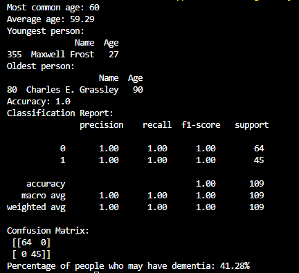
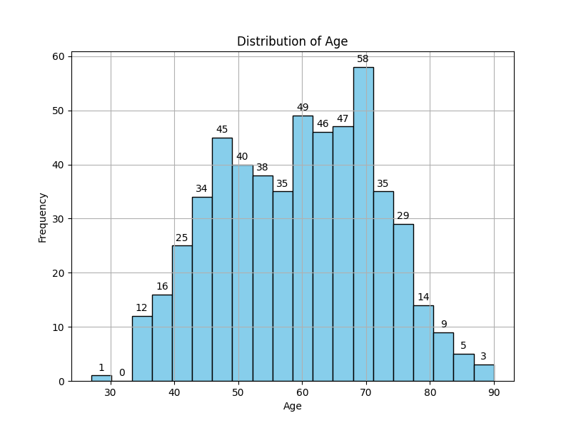

# Dementia Risk Prediction in Government: Machine Learning Project
## Description
This project aims to predict the likelihood of dementia based on age using logistic regression. It combines data from CSV files containing demographic information about individuals from the Senate and the House of Representatives.

Disclaimer: This is for educational purposes and demonstrates a simplified approach to predicting the likelihood of dementia based on age. The results obtained from this project should not be considered as a diagnosis. 

### Connecting to SQLite Database
- The code connects to an in-memory SQLite database.

### Loading Data
- CSV data from the Senate and the House of Representatives are loaded into Pandas DataFrames.

### Data Analysis
- Calculates the most common age, average age, youngest people, and oldest people in the dataset.

### Logistic Regression
- Uses logistic regression to predict the likelihood of dementia based on age.

### Plotting
- Generates histogram to visualize the data and model predictions.

## References
- https://fiscalnote.com/blog/how-old-118th-congress
- SQLite: https://docs.python.org/3/library/sqlite3.html
- Pandas: https://pandas.pydata.org/
- scikit-learn: https://scikit-learn.org/stable/
- Matplotlib: https://matplotlib.org/
